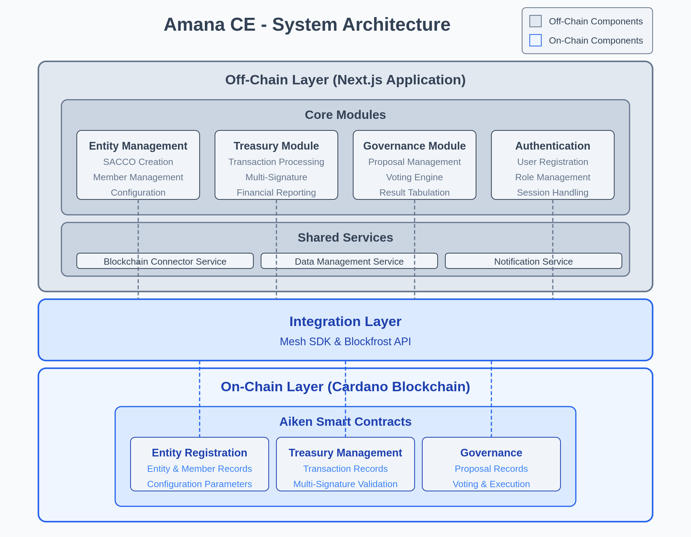

# Amana Chain Entities (Amana CE) Platform

## Overview
Amana CE is a blockchain-based solution built on Cardano that addresses key challenges facing Savings and Credit Cooperative Organizations (SACCOs) in Africa through enhanced transparency, improved governance, and operational efficiency.

## Problem Statement
SACCOs face issues with funds mismanagement, poor governance, and limited geographical access. Our solution transforms these organizations using blockchain technology.

## Value Proposition
Our modular architecture allows SACCOs to adopt blockchain features incrementally while maintaining data ownership and achieving immutable financial records with automated governance.

## Technical Architecture

### Tech Stack
- **Frontend**: Next.js with TypeScript, Tailwind CSS, React Query
- **Backend**: Next.js API Routes, Node.js, MongoDB
- **Blockchain**: Cardano (Aiken smart contracts), Blockfrost, Mesh SDK

### System Architecture
Amana CE implements a hybrid architecture combining blockchain and traditional web technologies, with a unique modular design allowing SACCOs to adopt specific components based on their needs.

#### Core Architectural Principles

##### Modular Architecture
- **Independently Adopted**: SACCOs can implement specific modules based on needs
- **Incrementally Deployed**: Organizations can gradually add more advanced features
- **Customizable**: Each module can be configured for specific operational requirements
- **Independently Updatable**: Modules can be improved without affecting the entire system

##### Layered Implementation
**On-Chain Layer**
- Smart contracts for entity registration, treasury management, and governance
- On-chain transaction records for all financial activities
- Decentralized voting mechanisms for transparent decision-making
- Cryptographic proof of membership and participation

**Off-Chain Layer**
- User-friendly interfaces for all SACCO operations
- Off-chain data storage for non-critical information
- Caching mechanisms for performance optimization
- Integration services between blockchain and application

### Module Specifications

#### 1. Entity Management Module
Handles SACCO creation, configuration, and member management.

**Key Components**:
- Entity registration service
- Member management system
- Configuration management
- KYC integration

**Blockchain Integration**:
- Entity registry smart contract
- Member identity verification
- Configuration parameter storage

#### 2. Treasury Module
Manages all financial operations within the SACCO.

**Key Components**:
- Transaction processing service
- Multi-signature workflow engine
- Financial reporting system
- Balance tracking service

**Blockchain Integration**:
- Treasury management smart contract
- Transaction record storage
- Multi-signature verification
- Fund allocation logic

#### 3. Governance Module
Enables transparent and democratic decision-making.

**Key Components**:
- Proposal management system
- Voting engine
- Result tabulation service
- Automated execution service

**Blockchain Integration**:
- Governance smart contract
- Vote recording and verification
- Result immutability
- Proposal execution triggers

#### 4. Authentication Module
Handles user identity and access control.

**Key Components**:
- User registration and login
- Role-based permission system
- Session management
- Security services

**Blockchain Integration**:
- On-chain identity verification
- Permission validation
- Role attestation

### Shared Service Modules

#### 1. Blockchain Connector Service
Provides standardized interfaces for blockchain interaction.

**Key Functions**:
- Smart contract interaction via Mesh SDK
- Transaction building and submission
- Address management
- Event monitoring

#### 2. Data Management Service
Handles data storage, retrieval, and synchronization.

**Key Functions**:
- Database operations
- Caching strategies
- Data validation
- Consistency maintenance

#### 3. Notification Service
Manages system and user notifications.

**Key Functions**:
- Event processing
- User notifications
- Alert mechanisms
- Communication channels

## Smart Contract Implementation

### Entity Registration Contract
**Key Functions**:
- `createEntity`: Establishes a new SACCO with configurable parameters
- `addMember`: Registers a new member to an existing SACCO
- `updateEntityParams`: Modifies entity configuration within allowed parameters
- `getMemberStatus`: Retrieves membership information

**Data Structures**:
- `Entity`: Core data structure representing a SACCO
- `Member`: Structure representing individual members
- `EntityParams`: Configurable parameters for entity operation

### Treasury Management Contract
**Key Functions**:
- `deposit`: Records member contributions to the treasury
- `withdrawalRequest`: Initiates a withdrawal process
- `approveWithdrawal`: Registers approval for a pending withdrawal
- `executeTransaction`: Completes approved transactions
- `getTransactionHistory`: Retrieves historical transaction data

**Data Structures**:
- `Transaction`: Record of financial operations
- `Treasury`: Current state of the SACCO's funds
- `ApprovalStatus`: Tracking for multi-signature requirements

### Governance Contract
**Key Functions**:
- `createProposal`: Submits a new proposal for consideration
- `castVote`: Records a member's vote on a proposal
- `resolveProposal`: Determines the outcome of a completed vote
- `executeProposal`: Implements approved proposals automatically
- `getVotingHistory`: Retrieves historical voting data

**Data Structures**:
- `Proposal`: Structure containing proposal details
- `Vote`: Record of individual votes
- `ProposalStatus`: Tracking of a proposal's lifecycle

## Development Approach

### Module-Based Implementation
Each functional module has its own set of UI components, services, and state management.

**Module Structure**:
- Components: Reusable UI elements specific to the module
- Services: Business logic and API interactions
- Hooks: Custom React hooks for state and behavior
- Types: TypeScript definitions for module data
- Utils: Utility functions specific to the module

**Shared Resources**:
- UI Components: Common design system elements
- Authentication: Shared identity services
- API Clients: Reusable API interaction patterns
- Utilities: Cross-cutting helper functions

### Integration Implementation
**Blockchain Connector Service**
This service uses Mesh SDK to handle communication between the web application and Cardano blockchain.

**Key Functions**:
- Transaction building and submission
- Smart contract interaction
- Address management
- Event monitoring and notification

**Implementation Approach**:
- Mesh SDK for transaction building and smart contract interaction
- Blockfrost API for blockchain data queries
- Custom middleware for transaction management
- Caching layer for performance optimization

## Development Phases
1. **Foundation**: Environment setup, architecture design, schema definition
2. **Core Contract Development**: Smart contract implementation and testing
3. **Module Development**: Implementation of core and shared modules
4. **Integration and Refinement**: Cross-module integration and optimization

## Technical Challenges and Mitigations

### Module Interdependencies
**Mitigation**:
- Clear interface definitions between modules
- Versioned APIs for module interactions
- Shared state management patterns
- Comprehensive integration testing

### Blockchain Performance
**Mitigation**:
- Batch transactions where possible
- Optimize on-chain vs. off-chain operations
- Implement efficient caching strategies
- Use pagination for large data sets

### User Experience with Blockchain
**Mitigation**:
- Abstract blockchain complexity from users
- Provide clear transaction status indicators
- Implement optimistic UI updates
- Design intuitive interfaces for blockchain concepts

### Smart Contract Limitations
**Mitigation**:
- Focus on essential functionality for MVP
- Implement modular contract design
- Balance on-chain and off-chain operations
- Design for future extensibility

## Future Technical Roadmap
- Mobile application development
- Additional specialized modules
- Enhanced inter-module workflows
- Integration with additional DeFi services
- Mainnet deployment and cross-SACCO interoperability

---

For more detailed information, please refer to our [comprehensive technical documentation](https://docs.google.com/document/d/1KstDmXA2Fgreiy4IBqGfF6hFAKm_1Ws2If2ishyhLbM/edit?usp=sharing).