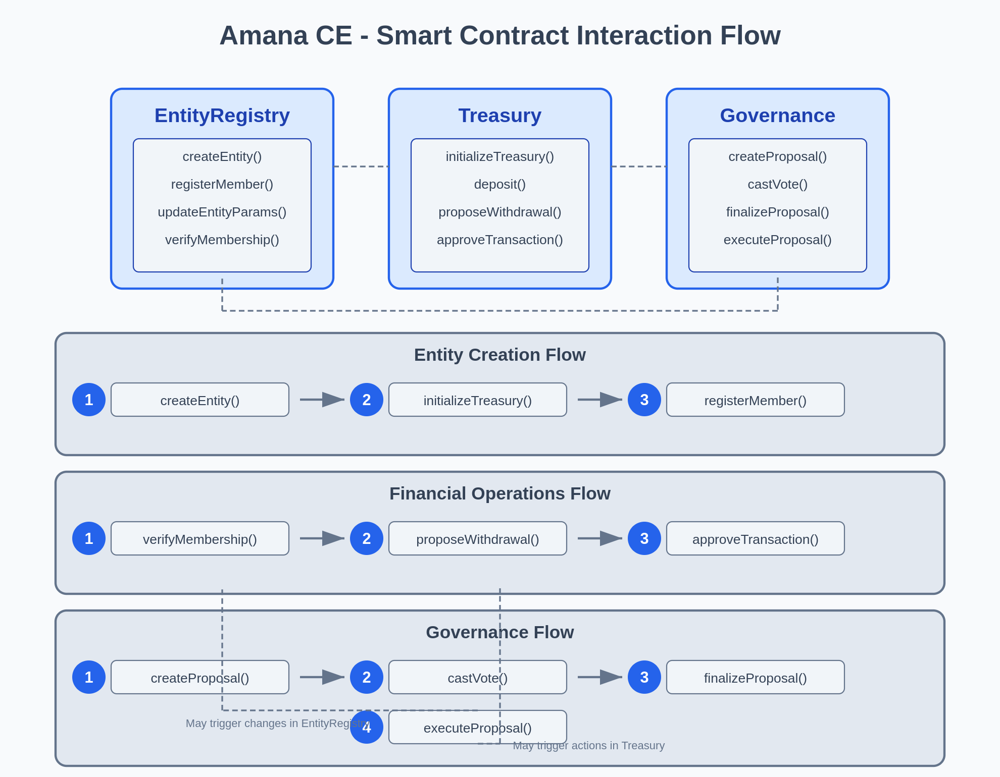

# Amana CE - Smart Contract Specifications

## Overview

The Amana Chain Entities (Amana CE) platform implements a set of smart contracts on the Cardano blockchain using Aiken language. These contracts provide the foundation for decentralized Savings and Credit Cooperative Organizations (SACCOs).

## Contract Architecture

The system consists of three primary smart contracts:

1. **EntityRegistry Contract**: Manages SACCO entities and membership
2. **Treasury Contract**: Handles financial operations and multi-signature approvals
3. **Governance Contract**: Enables proposals, voting, and execution of decisions

## Contract Descriptions

### 1. EntityRegistry Contract

**Purpose**:
- Establish on-chain representations of SACCOs
- Manage membership records
- Store entity configuration parameters
- Provide verification of entity and member status

**Key Functions**:
- `createEntity`: Creates a new SACCO on the blockchain
- `updateEntityParameters`: Updates configuration parameters
- `registerMember`: Adds new members to a SACCO
- `updateMemberStatus`: Changes a member's status
- `updateEntityStatus`: Updates a SACCO's operational status
- `verifyMembership`: Verifies membership status

### 2. Treasury Contract

**Purpose**:
- Manage SACCO funds securely on the blockchain
- Implement multi-signature approval for transactions
- Record all financial activities with immutable audit trail
- Enforce spending policies and limits

**Key Functions**:
- `initializeTreasury`: Sets up a treasury for a new SACCO
- `deposit`: Records member contributions
- `proposeWithdrawal`: Initiates funds withdrawal process
- `approveTransaction`: Records approval for a pending transaction
- `rejectTransaction`: Records rejection of a transaction
- `executeTransaction`: Completes approved transactions
- `getTreasuryBalance`: Retrieves current balance
- `getTransactionHistory`: Retrieves transaction records

### 3. Governance Contract

**Purpose**:
- Facilitate creation and submission of proposals
- Implement secure and transparent voting mechanisms
- Record voting results with blockchain verification
- Automate execution of approved decisions

**Key Functions**:
- `createProposal`: Creates a new proposal for voting
- `castVote`: Records a member's vote
- `finalizeProposal`: Tallies votes and determines results
- `executeProposal`: Implements approved decisions
- `cancelProposal`: Cancels active proposals
- `getProposalDetails`: Retrieves proposal information
- `getVotingResults`: Retrieves voting statistics

## Smart Contract Interaction Flow

1. **Entity Creation and Membership**
   - Create entity through EntityRegistry
   - Initialize treasury for the entity
   - Register members to the entity

2. **Financial Operations**
   - Members deposit funds to the treasury
   - Members/admins propose withdrawals
   - Admins approve or reject transactions
   - Execute approved transactions

3. **Governance Process**
   - Members create proposals
   - Members cast votes during voting period
   - System finalizes proposals based on votes
   - Approved proposals are automatically executed

## Security & Validation

**Authorization Rules**:
- Entity-level security controls who can manage SACCOs
- Treasury security ensures proper fund management
- Governance security enforces fair voting processes

**Technical Considerations**:
- Script size optimization for Cardano's limitations
- Transaction cost management through efficient design
- Comprehensive error handling
- Future-proof design for extensibility

## Testing Strategy

- Unit testing of individual functions
- Integration testing of contract interactions
- Security testing of authorization boundaries

---

For more detailed information, please refer to our [comprehensive technical documentation](https://docs.google.com/document/d/1fRsv1MLIDBqmD6Yrhlr25KuxCUBKgffA4iucLvhOqnQ/edit?usp=sharing).